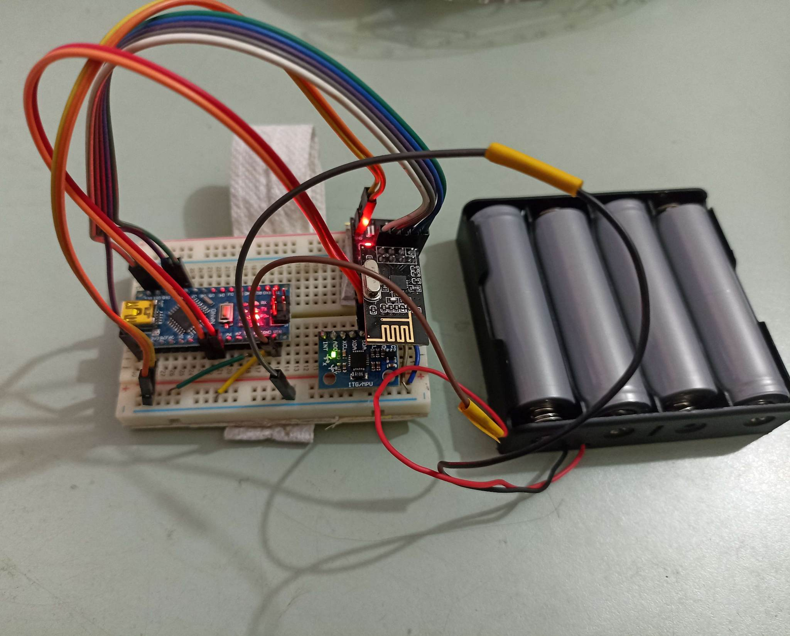

# GestureControlCarTx

## Hardware Configuration

### Hardware Components


A gesture control car transmitter using Arduino Nano, NRF24L01 with adapter, MPU 6050, and a 12V DC battery can be used to control a remote-controlled car using hand gestures. The NRF24L01 is a wireless transceiver module that can be used to send data wirelessly to the car's receiver. The MPU 6050 is an accelerometer and gyroscope sensor that measures the movement and orientation of the user's hand. The 12V DC battery powers the entire system. To use this system, the user would wear the transmitter device on their hand. The device is equipped with the MPU 6050 sensor and the NRF24L01 module with adapter. The MPU 6050 sensor measures the movement and orientation of the user's hand and sends this data to the NRF24L01 module, which transmits it wirelessly to the car's receiver. The car's receiver, which is equipped with an Arduino Nano and an L298N motor driver, processes the data received from the transmitter and uses it to control the motors of the car. The car can be made to move forward, backward, left, or right depending on the hand gestures made by the user. Overall, this system allows the user to control a remote-controlled car using hand gestures, providing a fun and interactive way to play with the car.

For the Tx module of this project, pins of nRF24L01 module will be connected to Arduino nano according to the following table:

| nRF24L01 | Arduino Nano |
|--|--|
| V<sub>cc</sub> | 3.3V |
| GND | GND |
| CSN<sup>[1](#footnote1)</sup> | 9 |
| CE<sup>[1](#footnote1)</sup> | 8 |
| SCK | 13 |
| MOSI | 11 |
| MISO | 12 |
| IRQ | Not Connected |

For the Tx module of this project, pins of MPU6050 will be connected to Arduino nano according to the following table:

| MPU6050 | Arduino Nano |
|--|--|
| V<sub>cc</sub> | 5V |
| GND | GND |
| SDA | A4 |
| SCL | A5 |

### Sample Hardware 

A labeled Figure of the hardware implementation.



## Loading Sketch

This project is developed and tested in EndeavourOS (https://endeavouros.com/) machine. For all Arch based systems following instructions are expected to work.

### Install VS Code

install VS Code if not installed already. For Arch based systems, run the following command in the terminal:

```bash
yay -S visual-studio-code-bin
```

### Install PlatformIO

PlatformIO was used for smoother development and debugging features. It has all the necessary tool-chains for embedded system development. Install the [PlatformIO extension](https://marketplace.visualstudio.com/items?itemName=platformio.platformio-ide) for VS Code.

Launch VS Code Quick Open ( <kbd>Ctrl</kbd> + <kbd>P</kbd> ), paste the following command, and press enter.

```bash
ext install platformio.platformio-ide
```

>Arduino IDE is also one of its dependency. install it if not installed already with the following command:
> ```bash
> yay -S arduino-ide-bin
> ```
>
>If facing any problem to upload code to device, these commands may faix it on Arch based systems:
> ```bash
>$ sudo uucp -a -G dialout $USER
>```

### Configuring PlatformIO  

Plug in the Arduino USB cable in a USB port and issue following command:

```bash
$ sudo dmesg | grep tty
```

The last line of the output should contain the name of the serial port the arduino is connected to. It should be something like `ttyACM0`  or `ttyUSB0`.

Now navigate to __platformio.ini__ file located in the project root directory and set the `upload_port` and `monitor_port` to the serial port name the Arduino is connected to.

Example:

```ini
[env:nanoatmega328]
platform = atmelavr
board = nanoatmega328
framework = arduino
upload_port = /dev/ttyUSB1
monitor_port = /dev/ttyUSB1
monitor_speed = 115200
```
Follow the [official documentation](https://docs.platformio.org/en/latest/integration/ide/vscode.html) of platformIO if necessary.

### Upload Sketch

Upon connecting the board and configuring it correctly, Open VS Code command pallette with pressing <kbd>Ctrl</kbd> + <kbd>Shift</kbd> + <kbd>P</kbd>.

Use the `PlatformIO: Upload` command to upload the code to the board.

## References

1. How nRF24L01+ Wireless Module Works & Interface with Arduino, [Last Minute Engineering](https://lastminuteengineers.com/nrf24l01-arduino-wireless-communication/)
2. Implemantation of Gesture Control Car, [Tutorial](https://www.youtube.com/watch?v=fec-XFwayz8&list=PL7KL0pPF3rFrUZ0xwpXf3wKqHO7sl4zLd&index=1&t=165s)
